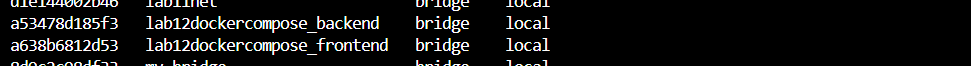

# Labolatrium 12
Stworzenie docker-compose ze stackiem LEMP.

### Polecenie 1
uruchomienie pliku compose:
docker-compose up -d

### Polecenie 2
Sprawdzenie działających kontenerów:
docker compose ps

### Polecenie 3
Sprawdzenie sieci 
docker network ls

### Sprawdzenie 
Wyświetlenie strony php: http://localhost:4001

Wyświetlenie phpMyAdmin: http://localhost:6001

Założenie testowej bazy:

### polecenie 4
Zatrzymanie lempa:
docker compose down 
